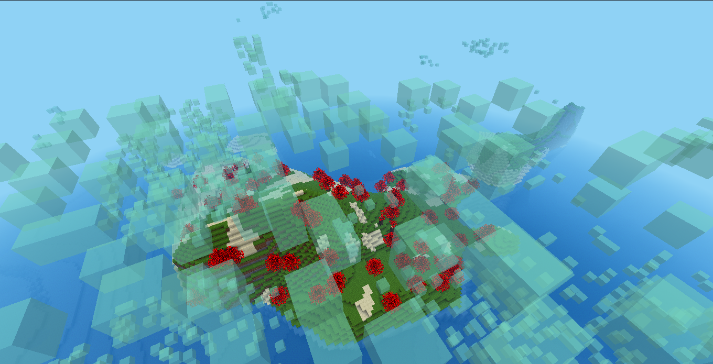

# Floof

Some fluffy biomes and item set inspired by Minecraft's BicBiomeCraft and other mods.

## Features

- `tung_forest` biome.

- Automatically generated solid bouncy clouds that could be collected as building blocks.

- More to come.

# Status

WIP

## Version

0.1.0

## Art credits

- Tung textures from [BicBiomeCraft](https://www.curseforge.com/minecraft/mc-mods/bicbiomecraft).
- Smoke and fire particles textures from [smoke_signal mod](https://content.luanti.org/packages/Just_Visiting/smoke_signals/).

## License

This mod is released under the same distributed Luanti license which is LGPL-2.1. For further information, please see `LICENSE` file.
