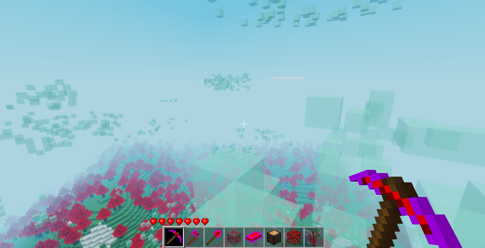

# Floof

Some fluffy biomes and item set inspired by Minecraft's BicBiomeCraft and other mods.

## Features

- `tung_forest` biome with tung trees and generated solid bouncy clouds in the sky.
- Tung tools.

### Tung

Pickaxe, axe and shovel tools. Can remove blocks very quickly.

#### Tree

- Leaves have a chance to drop a coal lump along with sapling.

- Tree log/trunk could drop a block of tung ore, diamond gem or a coal lump. ***Must use one of the tung tools to chop the log for these loot drops***.

- Cosmetic effect: Leaves will emit smoke and fire particles indefinitely.

### Pendulum

#### Clouds

- Solid, semi-transparant bouncy clouds in the sky which can only be found in `tung_forest` biome. Player can break them and use as building blocks.

# Status

WIP (more coming soon ^^)

## Version

0.1.0

## Art credits

- Tung textures from [BicBiomeCraft](https://www.curseforge.com/minecraft/mc-mods/bicbiomecraft).
- Smoke and fire particles textures from [smoke_signal mod](https://content.luanti.org/packages/Just_Visiting/smoke_signals/).

## License

This mod is released under the same distributed Luanti license which is LGPL-2.1. For further information, please see `LICENSE` file.
