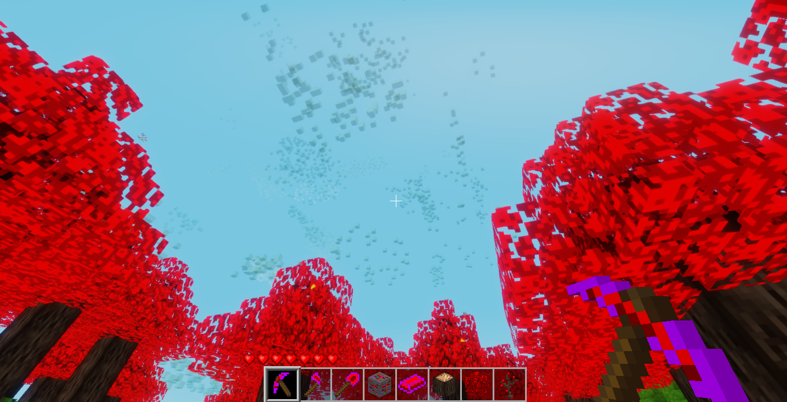

# Floof

Add BicBiomeCraft inspired biomes, tools, and items.

## Features

- `tung_forest` biome with tung trees and generated solid bouncy clouds in the sky.
- Tung tools.

### Tung

Pickaxe, axe and shovel tools. Can remove blocks very quickly.

#### Ores & Ingots

- Tung ore. Requires more or stronger fuel source to smelt. Shares depth and rarity of gold ores.
- Tung ingot. The product when tung ore has been smelted. Can be crafted into
powerful Tung tools.

#### Tree

- Leaves have a chance to drop a coal lump along with sapling.

- Tree log/trunk could drop a block of tung ore, diamond gem or a coal lump. ***Must use one of the Tung tools to chop the log for these loot drops***.

- Cosmetic effect: Leaves will emit smoke and fire particles indefinitely.

### Pendulum

#### Clouds

- Solid, semi-transparent bouncy clouds in the sky which can only be found in `tung_forest` biome. Player can break them and use as building blocks.

# Status

WIP (more coming soon ^^)

## Version

0.3.0

## Art credits

- Original trees, tools and ores textures from [Luanti's minetest_game](https://github.com/luanti-org/minetest_game) by Cisoun under the [CC-BY-SA-3.0](http://creativecommons.org/licenses/by-sa/3.0/).
- Smoke and fire particles textures from [smoke_signal](https://content.luanti.org/packages/Just_Visiting/smoke_signals/) by Just_Visiting under the [CC-BY-SA-4.0](https://creativecommons.org/licenses/by-sa/4.0/deed.en) license.

## Reporting issues

Please go to [issues](https://github.com/cloudyluna/floof/issues) if you want to report a bug or submit a
suggestion.

### Radicle repository

- RID: `rad:z2tRR3CN4iN5E7a3rQrfGzMuProMo`
- Radicle clone: `rad clone rad:z2tRR3CN4iN5E7a3rQrfGzMuProMo`
- Git clone: `git clone https://seed.radicle.garden/z2tRR3CN4iN5E7a3rQrfGzMuProMo.git floof`
- Direct download: `curl -OJ https://seed.radicle.garden/raw/rad:z2tRR3CN4iN5E7a3rQrfGzMuProMo/archive/main`

Online repository browser: [app.radicle.xyz](https://app.radicle.xyz/nodes/seed.radicle.garden/rad%3Az2tRR3CN4iN5E7a3rQrfGzMuProMo)

## License

This mod is released under the same distributed Luanti license which is LGPL-2.1. For further information, please see `LICENSE` file.
